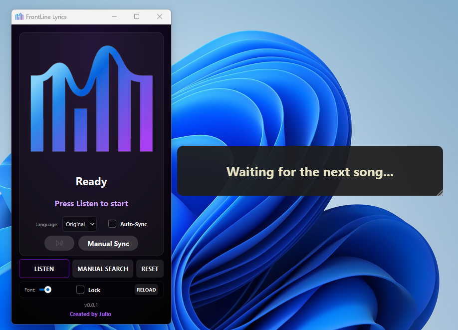
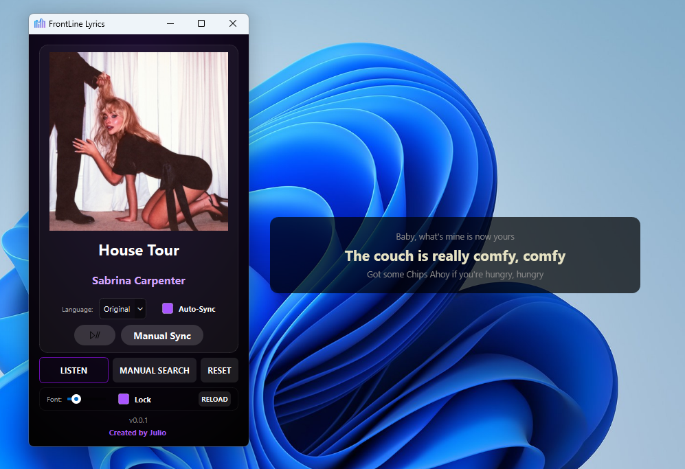
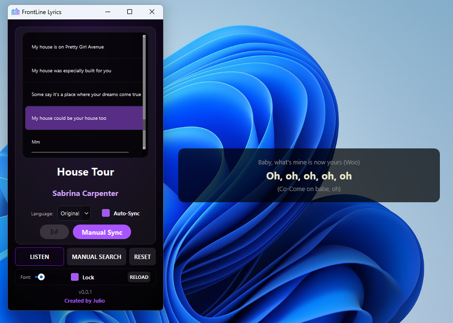
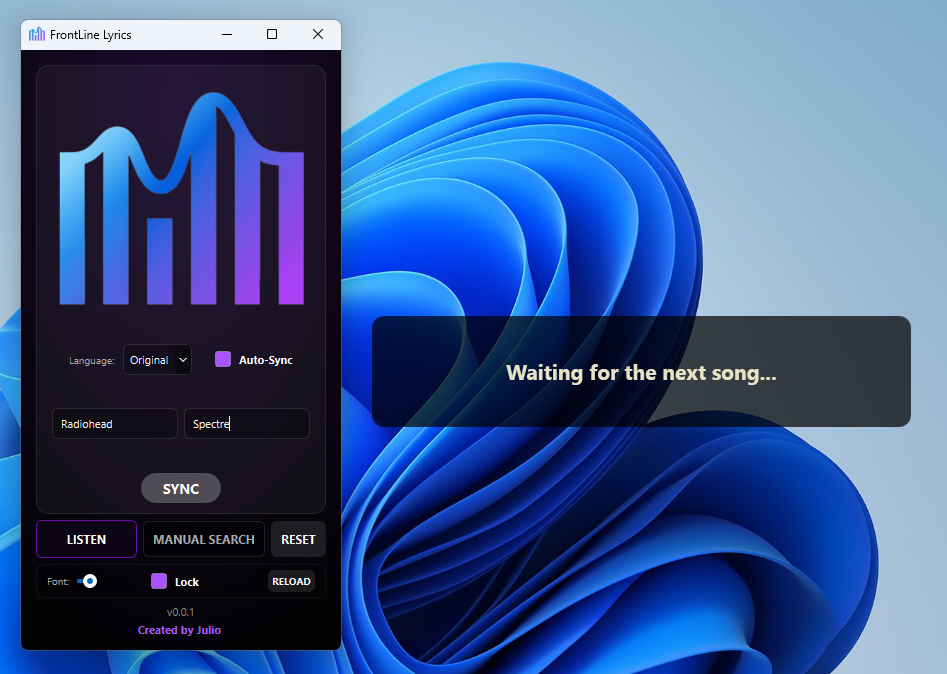
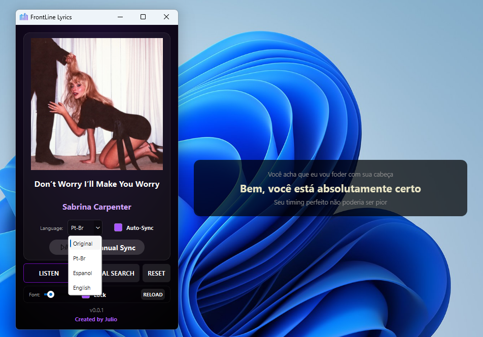
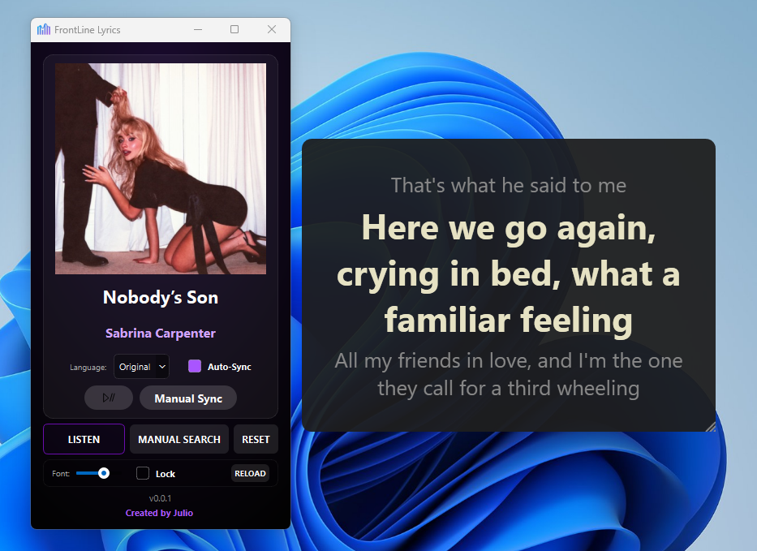

  

  

  
  
  
  
  

## Introduction
**FrontLine Lyrics** is an open-source desktop application that brings live, synchronized lyrics straight to your screen. By listening to your computer's system audio, it automatically identifies the song currently playing and displays its lyrics in a beautiful, floating transparent overlay. It works seamlessly with Spotify, YouTube, Apple Music, or any media player playing on your Windows PC.

## Summary of Features
* **Automatic Recognition**: Identifies the music being played on your system's standard audio output.
* **Synchronized Lyrics**: Fetches time-synced lyrics from LRCLib and displays them in real-time.
* **Glass UI Deck**: Control panel to manage your lyrics, view album art, and toggle settings.
* **Floating Desktop Overlay**: A borderless, transparent lyrics overlay that sits on top of your screen, completely independent of your browser.
* **Smart Auto-Sync**: Automatically detects when a song ends and starts listening for the next track seamlessly.
* **Manual Sync Control**: Built-in search functionality and a manual sync list—just click a line to instantly correct the timing if the lyrics are off.
* **On-the-fly Translation**: Instantly translate synchronized lyrics into multiple languages (PT-BR, ES, EN).
* **Privacy-First**: No voice or audio data is saved or transmitted. It only uses local audio loopback to generate an anonymous fingerprint for recognition.

## Technologies Used
This project uses a hybrid architecture.

**Core Logic & UI (Python):**
* **Python**: Core logic, audio processing, and application state.
* **PyQt6**: The user interface.
* **PyAudioWpatch**: For capturing system audio (WASAPI loopback) without needing a virtual audio cable.
* **Shazamio**: Asynchronous framework for reverse-engineering the Shazam API to identify songs.
* **LRCLib**: [LRCLib](https://lrclib.net/) for fetching all synchronized `.lrc` lyrics seamlessly.
* **Deep Translator**: For real-time, on-the-fly lyric translations.
* **WebSockets**: Facilitates lightning-fast, local communication between the Python backend and the C# overlay.

**Floating Overlay (C# / .NET):**
* **C# / WPF**: Powers the `FrontLineOverlay.exe`, creating a borderless, transparent, and always-on-top window that renders the lyrics.

---

### Visual Guide & Key Features

Take a quick look at FrontLine Lyrics in action, from identifying a song to manual sync adjustments.

<table>
  <tr>
    <td align="center">
      
       
      <b>1. Identifying a song</b>
      
Click LISTEN and the Deck analyzes your system audio to identify the current track.

    </td>
  </tr>
  <tr>
    <td align="center">
      
       
      <b>2. Seamless Synchronization</b>
      
Album art is fetched, and the floating overlay immediately displays time-synced lyrics.

    </td>
  </tr>
  <tr>
    <td align="center">
      
       
      <b>3. Interactive Manual Sync</b>
      
Is the timing slightly off? Open the lyric list and click on the part of the song that will be sung to jump and correct the sync instantly.

    </td>
  </tr>
  <tr>
    <td align="center">
      
       
      <b>4. Manual Search</b>
      
Audio too quiet or obscure? Search for the Artist and Song manually to force lyric synchronization.

    </td>
  </tr>
  <tr>
    <td align="center">
      
       
      <b>5. On-the-fly Translation</b>
      
Select a different language to translate the lyrics in real-time without losing the beat.

    </td>
  </tr>
  <tr>
    <td align="center">
      
       
      <b>6. Overlay Configuration</b>
      
Resize the font or lock the transparent overlay in place directly from the Deck.

    </td>
  </tr>
</table>

---

## Installation Guide

FrontLine Lyrics is exclusively available through the **Microsoft Store**. This ensures you always have the latest version installed safely and with automatic updates.

**Prerequisites:** Windows 10 or 11.

1. Click the badge below to open the official download page:
    
   
    
2. Click **Get** or **Install** in the Microsoft Store app.
3. The Store will automatically handle the download and install any required dependencies (like the .NET Desktop Runtime) for you.
4. Launch FrontLine Lyrics directly from your Start Menu!

---

## How to Use FrontLine Lyrics

### The Main Deck
When you open the application, you'll see the **FrontLine Deck** — your main control center.

1. **Start Listening**: Play a song on your computer (Spotify, YouTube, etc.) and click the **LISTEN** button. The app will briefly analyze the audio and fetch the lyrics and album art.
2. **The Overlay**: Once the song is identified, the transparent lyrics overlay will appear on your screen.
3. **Overlay Settings**: At the bottom of the Deck, you can:
    * Adjust the **Font Size** of the overlay using the slider.
    * Toggle **Lock Mode** to prevent the overlay from being accidentally moved.
    * Click **Reload** if the overlay window accidentally closes.
4. **Auto-Sync**: Check the **Auto-Sync** box next to the language selector. When your current song ends, the app will automatically wait a few seconds and start listening for the next track.

### Correcting Lyrics (Manual Sync & Search)
If the audio is too quiet, live, or obscure:
* Click **MANUAL SEARCH** to reveal the search bar. Type the artist and song name, then click **SYNC** to force the app to fetch those specific lyrics.

If the lyrics are slightly out of sync with the audio:
1. Click the **Pause** button in the middle of the Deck to freeze the lyrics. Wait for the singer to catch up to the highlighted line, then unpause.
2. Alternatively, click the **Manual Sync** button. A list of all the lyrics will appear over the album art. Simply click on the part of the song that will be sung, and the overlay will instantly jump to that exact moment!

---

## Troubleshooting & FAQ

* **The app is stuck on "Listening..." or says "Lyrics not found."**
  * Ensure your computer's audio is actually playing through the default speakers/headphones. The app cannot "hear" audio routed through exclusive-mode applications or complex virtual audio cables unless set as default.
  * If the song is instrumental or very obscure, lyrics might not exist in the LRCLib database. Use **Manual Search** to try finding them by text.

* **The Overlay window disappeared!**
  Simply click the **RELOAD** button at the bottom of the Deck to restart the overlay process.

* **How do I move the overlay?**
  Make sure the **Lock** checkbox at the bottom of the Deck is *unchecked*. Then, simply click and drag anywhere on the lyrics text on your screen to move the window.

*Check out the version as a Chrome extension: [FrontLine Lyrics Chrome Extension](https://github.com/juliocax/FrontLine-Lyrics-Extension).*
