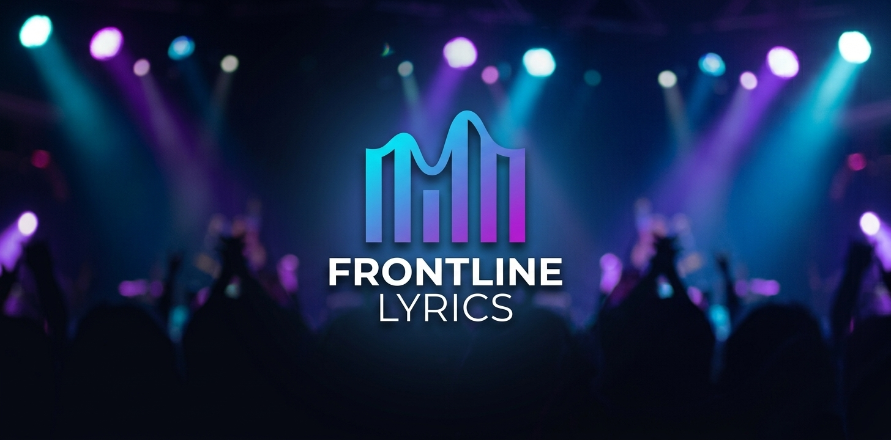
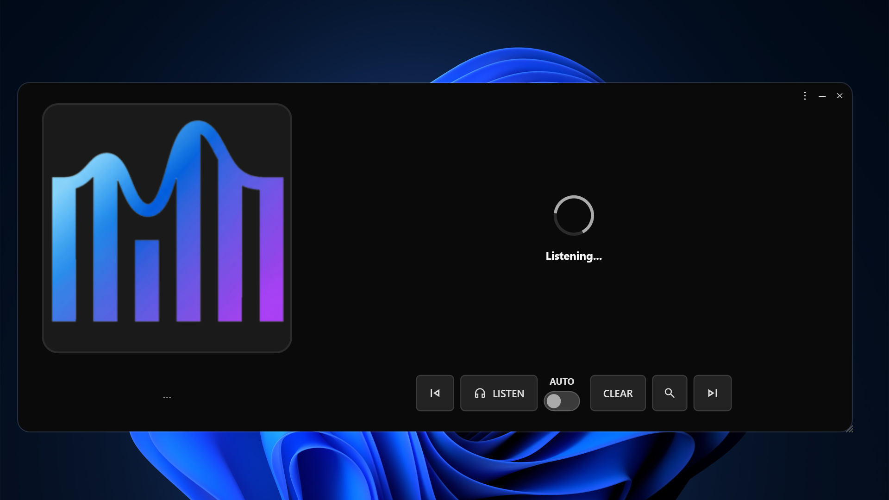
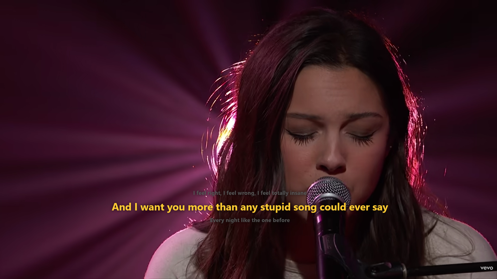
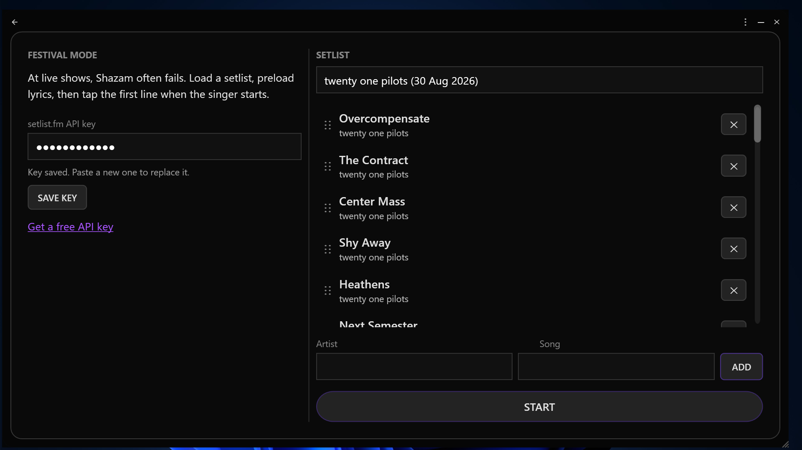
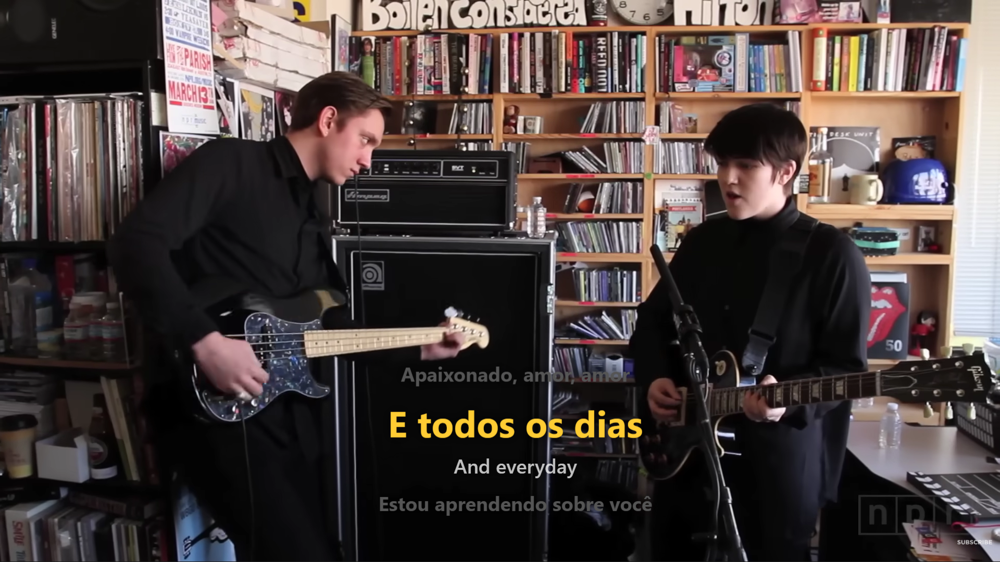
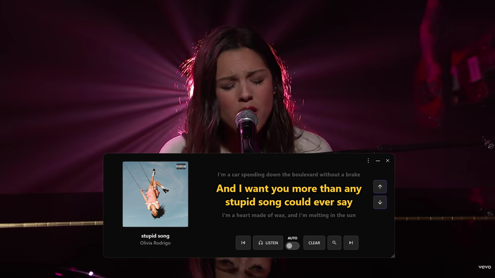

<div align="center">




**Real-time, synced lyrics for whatever is playing on your PC.**

[](https://get.microsoft.com/installer/download/9P6LNJCL8ZCC?referrer=appbadge&cid=readme)


[](CONTRIBUTORS.md)

<a href="https://get.microsoft.com/installer/download/9P6LNJCL8ZCC?referrer=appbadge&cid=readme" target="_self">
  
</a>


https://github.com/user-attachments/assets/0a6f3278-49b2-43f0-9004-6709d65f74b9


</div>

---

## Table of Contents

- [Introduction](#introduction)
- [Features](#features)
- [How It Works](#how-it-works)
- [Technologies Used](#technologies-used)
- [Installation](#installation)
- [Usage Guide](#usage-guide)
- [Screenshots](#screenshots)
- [Building From Source](#building-from-source)
- [Running Tests](#running-tests)
- [Contributing](#contributing)
- [Contributors](#contributors)
- [Support the Project](#support-the-project)
- [License](#license)

## Introduction

FrontLine Lyrics is a always-on-top overlay for Windows that listens to whatever is playing on your system and shows synced lyrics in real time, Spotify, YouTube, Apple Music, a local media player, or anything else that comes out of your speakers.

It works two ways, it can automatically follow the track info exposed by Windows' native media session (title, artist, playback position), and it can also *listen* to your system audio directly and recognize the song with Shazam, so it still works with sources that don't expose media metadata at all.

## Features

- **Automatic track detection**: via Windows Media Session (SMTC) reads title, artist and playback position straight from any compatible player, with no manual input.
- **Audio-fingerprint recognition**: as a fallback/primary source, records a snippet of system audio (WASAPI loopback) and identifies the song with Shazam.
- **Auto mode**: continuously re-listens and re-syncs as tracks change, with adaptive retry backoff and a cooldown guard against false "previous track" triggers.
- **Synced lyrics display**: an always-on-top, transparent, draggable overlay window that scrolls lyrics in time with the music.
- **Pause-aware sync**: pausing the track pauses the lyrics scroll too, so everything stays perfectly aligned when playback resumes.
- **Live translation**: translate the displayed lyrics into English, Spanish, French, Portuguese, or a romanized transliteration, resolved in parallel across multiple translation backends for reliability.
- **Manual search**: look up lyrics and cover art by artist/song name when you'd rather not rely on auto-detection.
- **Festival Mode**: built for live shows, where Shazam-based recognition can be slow or fail entirely due to crowd noise, distance from the speakers, etc. Instead of recognizing the song, you build a playlist for the show ahead of time and step through it line by line with dedicated "next/previous line" buttons, once you catch up to where the singer is, the app takes over and keeps the lyrics synced from there using the track's own timing.
- **Setlist.fm integration**: add your own [setlist.fm](https://www.setlist.fm/settings/apps) API key to search for a setlist by artist/band name (with optional country, venue, and year filters), pick from the top 10 matches, and drop it straight into Festival Mode as an editable playlist.
- **Playlist management**: Festival Mode playlists are saved locally, create as many as you want, edit them by adding or removing songs, and delete the ones you no longer need.
- **Manual sync adjustment everywhere**: the same next/previous line arrows used in Festival Mode are now also available for any track recognized via Shazam, letting you nudge the sync if it drifts. Not needed for tracks detected through the Windows Media Session API, since those already report accurate playback position.
- **Customizable overlay**: adjustable font size and a compact/expanded layout.
- **Multi-language UI**: interface available in English, Portuguese, Spanish, and Bahasa Indonesia.

## How It Works

FrontLine Lyrics is split into two cooperating processes:

1. **`FrontlineServer` (Python, headless)** — the audio/recognition engine. It captures system audio via WASAPI loopback, talks to the Windows Media Session API for auto-follow, fingerprints audio snippets with Shazam, fetches synced lyrics from LRCLIB, and runs translations. It's packaged as a standalone `.exe` with PyInstaller and exposes a local WebSocket server.
2. **`FrontLineOverlay` (C# / WPF)** — the visible overlay window. It launches the Python server as a child process on startup and communicates with it exclusively over the WebSocket, sending commands (`LISTEN`, `AUTO_TOGGLE`, `TRANSLATE`, `MANUAL_SEARCH`, etc.) and receiving live state broadcasts to render.

## Technologies Used

| Layer | Stack |
|---|---|
| Desktop overlay | C#, WPF (.NET) |
| Backend / audio engine | Python 3.13, `asyncio`, `websockets` |
| Audio capture | `pyaudiowpatch` (WASAPI loopback) |
| Song recognition | `shazamio` |
| Lyrics source | [LRCLIB](https://lrclib.net/) |
| Setlist source (Festival Mode) | [setlist.fm](https://www.setlist.fm/) API (user-provided key) |
| Translation | `deep-translator`, `translators` (parallel multi-backend resolution) |
| Media metadata (auto-follow) | Windows Runtime — `GlobalSystemMediaTransportControlsSessionManager` via `winrt` |
| Packaging | PyInstaller (server), MSIX (Microsoft Store) |
| Testing | `pytest`, `pytest-asyncio`, `pytest-mock`, `requests-mock` |


## Installation

The easiest way to install FrontLine Lyrics is through the Microsoft Store:

<a href="https://get.microsoft.com/installer/download/9P6LNJCL8ZCC?referrer=appbadge&cid=readme" target="_self">
  
</a>


## Usage Guide

1. Launch FrontLine Lyrics, the overlay appears on top of your other windows.
2. Play music in any app (Spotify, browser, local player, etc.).
3. Click **LISTEN** to start automatic recognition/follow, or toggle **AUTO** to keep it continuously syncing as tracks change.
4. Use **SEARCH** to look up lyrics by artist and song name directly.
5. Use the translation toggles (Orig / Rom / EN / ES / FR / PT) to switch how the lyrics are displayed.
6. Adjust font size, drag the window anywhere, and use the previous/next track buttons to control playback without leaving the overlay.
7. At a live show? Click **FESTIVAL** to switch modes. Build a playlist for the concert (manually, or by searching setlist.fm if you've added your API key), pick the song currently being played, and use the next/previous line arrows to catch up to where the singer is, the app takes it from there and keeps the lyrics synced automatically.
8. The same next/previous line arrows appear for any song recognized via Shazam, so you can manually correct the sync if it ever drifts.

## Screenshots

<table align="center">
  <tr>
    <td align="center"><br/><b>Home screen</b><br/>The initial screen when you open the overlay</td>
    <td align="center"><br/><b>Listening</b><br/>Recognizing what's currently playing</td>
  </tr>
  <tr>
    <td align="center"><br/><b>Synced lyrics</b><br/>Lyrics scrolling in sync with the music</td>
    <td align="center"><br/><b>Festival Mode</b><br/>Stepping through a show's setlist with manual line sync</td>
  </tr>
  <tr>
    <td align="center"><br/><b>Live translation</b><br/>Lyrics translated on the fly into another language</td>
    <td align="center"><br/><b>Manual sync</b><br/>Nudging the lyrics into sync line by line</td>
  </tr>
</table>

## Building From Source

Want to tinker with the code or build your own copy? Here's how:

1. Clone the repository:
   ```
   git clone https://github.com/juliocax/FrontLine-Lyrics-Desktop.git
   ```
2. Open Visual Studio and make sure the **.NET desktop development** workload (which includes WPF tooling) is installed.
3. Open [`Frontline.sln`](https://github.com/juliocax/FrontLine-Lyrics-Desktop/blob/main/Frontline.sln) in Visual Studio.
4. Set [`Frontline`](https://github.com/juliocax/FrontLine-Lyrics-Desktop/tree/main/Frontline) as the startup project and run it.

If you make changes to the Python backend (`FrontlineServer`), you'll also need to rebuild the standalone executable and swap it into the C# project so `Frontline` picks up your changes:

1. From the `FrontlineServer` folder, rebuild the `.exe` with PyInstaller:
   ```
   pyinstaller --noconfirm --onedir --windowed --collect-all anyascii --collect-all winrt \
     --hidden-import winrt.windows.media.control --hidden-import winrt.windows.storage.streams \
     --hidden-import engine --hidden-import engine.crash_guard --hidden-import engine.media_session \
     --hidden-import engine.music_manager --hidden-import engine.audio_capture \
     --hidden-import engine.recognition --hidden-import engine.lyrics --hidden-import engine.cover_art \
     --hidden-import engine.translation --hidden-import engine.smtc_policy --hidden-import engine.tuning \
     --hidden-import engine.task_utils --hidden-import engine.workers --hidden-import engine.ws_server \
     --name "FrontlineServer" "FrontlineServer.py"
   ```
2. From the `dist` folder created by PyInstaller, copy the `_internal` folder and `FrontlineServer.exe`, and use them to replace the existing ones in `Frontline/FrontlineServer`.
3. Run the `Frontline` project again — it will launch your updated server automatically.

## Running Tests

The Python backend (`FrontlineServer/engine`) has a `pytest` suite covering the pure logic modules (SMTC clock-trust heuristics, lyrics parsing/matching, translation racing, cover art caching, `MusicManager` state helpers) with all external network calls mocked, so the tests run offline and don't touch Shazam, LRCLIB, Deezer or the translation backends for real.

1. From the `FrontlineServer` folder, install the runtime and test dependencies:
   ```
   pip install -r requirements.txt
   pip install -r requirements-dev.txt
   ```
2. Run the suite:
   ```
   pytest
   ```
   Or, from the repository root:
   ```
   pytest FrontlineServer/tests/
   ```

Tests run automatically on every pull request via GitHub Actions (see `.github/workflows/python-tests.yml`).

## Contributing

Contributions are welcome! Before opening a pull request:

- Read [CONTRIBUTING.md](CONTRIBUTING.md) for how the project is organized, how to get set up on either side, and how to run the test suite.
- This project follows the [Code of Conduct](CODE_OF_CONDUCT.md), please read it before participating in issues, PRs, or discussions.

## Contributors

See [CONTRIBUTORS.md](CONTRIBUTORS.md) for the full list of people who have contributed code to this project.

## Support the Project

If FrontLine Lyrics is useful to you, consider [buying me a coffee](https://www.buymeacoffee.com/juliocax).

## License

See [LICENSE](LICENSE.txt) for more information.
